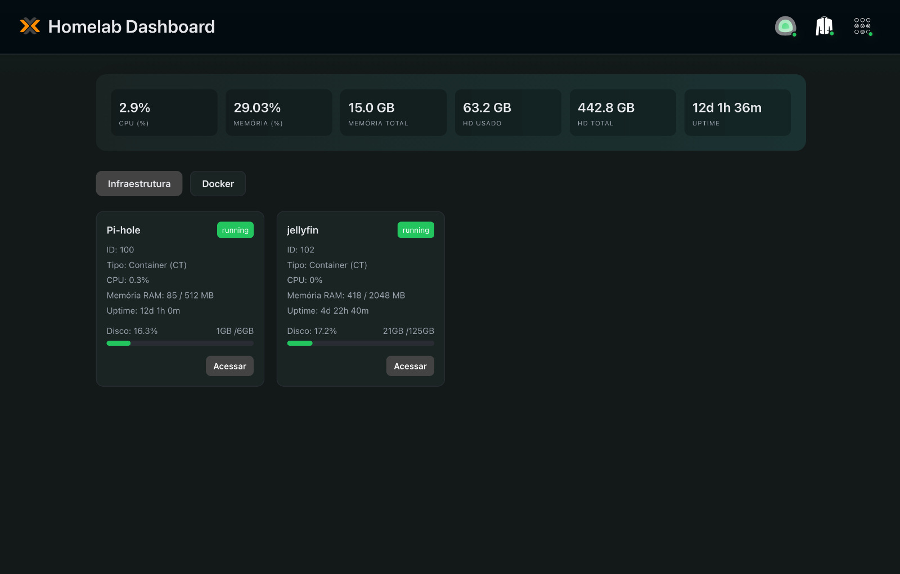
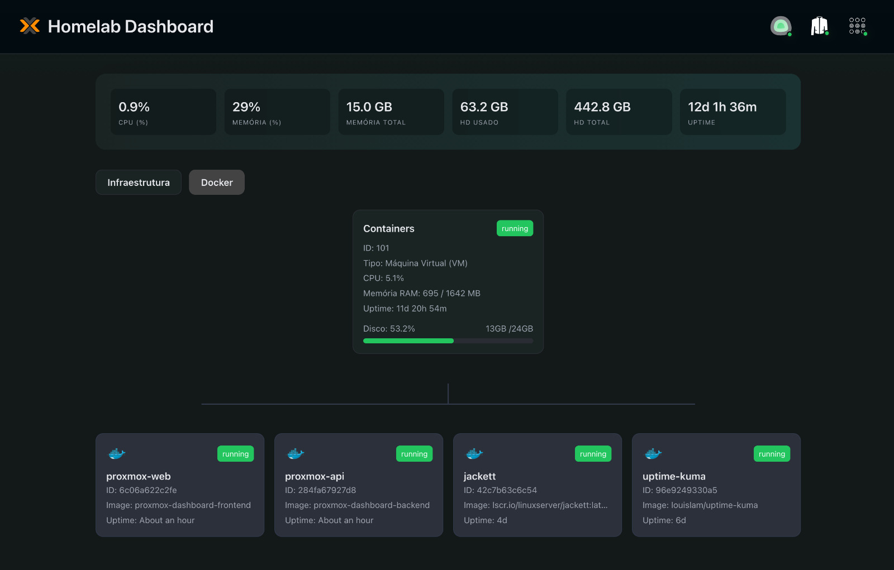

# Proxmox Dashboard

Aplicação fullstack desenvolvida para consumo próprio com o objetivo de centralizar e simplificar o monitoramento da minha infraestrutura local baseada em Proxmox.

O projeto combina:

- Backend em Node.js + TypeScript
- Frontend em React
- Agent dedicado em Go rodando diretamente na VM Docker Host

---

## Preview

<div align="center">
  
</div>

---

# Sobre o projeto

O dashboard abstrai a complexidade da API do Proxmox e apresenta os recursos da infraestrutura de forma visual, organizada e em tempo real.

Além das informações tradicionais de VMs e Containers LXC, o projeto também integra métricas e gerenciamento de containers Docker através de um agent customizado escrito em Go.

A ideia principal é possuir uma camada intermediária simples e personalizada para monitoramento do homelab.

---

# Funcionalidades

- Visualização de VMs e Containers (LXC)
- Monitoramento de CPU, RAM e Disco
- Dashboard em tempo real via SSE
- Visualização de containers Docker
- Estrutura visual separada por abas
- Topologia visual do Docker Host
- Quick Access para serviços internos
- Integração direta com Proxmox VE
- Deploy automatizado via GitHub Actions

---

# Arquitetura

O projeto é dividido em três partes principais:

```text
frontend/
backend/
agent-go/
```

---

# Frontend (React)

Responsável pela interface visual do dashboard.

## Estrutura

```text
frontend/src/
├── components/
├── pages/
├── services/
├── formatter/
├── helper/
├── interfaces/
└── styles/
```

## Tecnologias

- React
- TypeScript
- Vite
- styled-components

---

# Backend (Node.js + TypeScript)

Responsável por:

- integração com API do Proxmox
- normalização dos dados
- regras de negócio
- SSE
- integração com o Agent Go

## Estrutura

```text
backend/src/
├── controllers/
├── routes/
├── services/
├── mappers/
├── helpers/
├── guards/
├── interfaces/
└── constants/
```

## Tecnologias

- Node.js
- Express
- TypeScript
- node-fetch
- dotenv

---

# Agent Go

O projeto possui um agent dedicado escrito em Go rodando diretamente dentro da VM responsável pelos containers Docker.

Esse agent foi criado para expor informações que o Proxmox não fornece corretamente ou de forma precisa para esse cenário específico.

Atualmente ele é responsável por:

- Listagem de containers Docker
- Informações reais de memória da Docker Host VM
- Exposição de endpoints HTTP locais

## Estrutura

```text
agent-go/
├── controllers/
├── routes/
├── services/
├── helpers/
└── types/
```

## Tecnologias

- Go
- Gin
- Docker SDK for Go

---

# Endpoints

## Backend

```ts
"/api/dashboard";
"/api/overview";
"/api/services-status";
"/api/agent/containers";
```

---

## Agent Go

```ts
"/docker/containers";
"/system/memory";
```

---

# Atualização em tempo real

A aplicação utiliza Server-Sent Events (SSE) para atualização automática dos dados do dashboard.

As informações são sincronizadas periodicamente sem necessidade de refresh manual da página.

Atualmente:

- Dashboard → atualização em tempo real
- Serviços → sincronização automática
- Infraestrutura → monitoramento contínuo

---

# Docker

Frontend e backend são executados via Docker Compose.

Fluxo atual:

```text
Frontend (React)
        ↓
Backend API (Node.js)
        ↓
Proxmox API
        ↓
Agent Go
        ↓
Docker Engine
```

<div align="center">
  
</div>

---

# Deploy automático (CI/CD)

O projeto possui deploy automatizado utilizando:

- GitHub Actions
- Self-Hosted Runner
- Docker Compose

Fluxo:

```text
git push
   ↓
GitHub Actions
   ↓
Self-Hosted Runner
   ↓
deploy.sh
   ↓
Docker Compose
```

O script de deploy:

- atualiza o repositório
- rebuilda apenas os serviços alterados
- atualiza o Agent Go
- reinicia automaticamente os serviços necessários

---

# Segurança

Essa aplicação foi desenvolvida exclusivamente para ambiente privado/local.

O acesso é protegido pela própria infraestrutura de rede:

- VPN
- Rede local
- Reverse Proxy interno

A aplicação não possui autenticação própria por design.

---

# Observações

- Projeto voltado para uso pessoal
- Estrutura simples e pragmática
- Foco em legibilidade e monitoramento rápido
- Não possui objetivo comercial
- Algumas regras são específicas da infraestrutura atual do homelab

---
