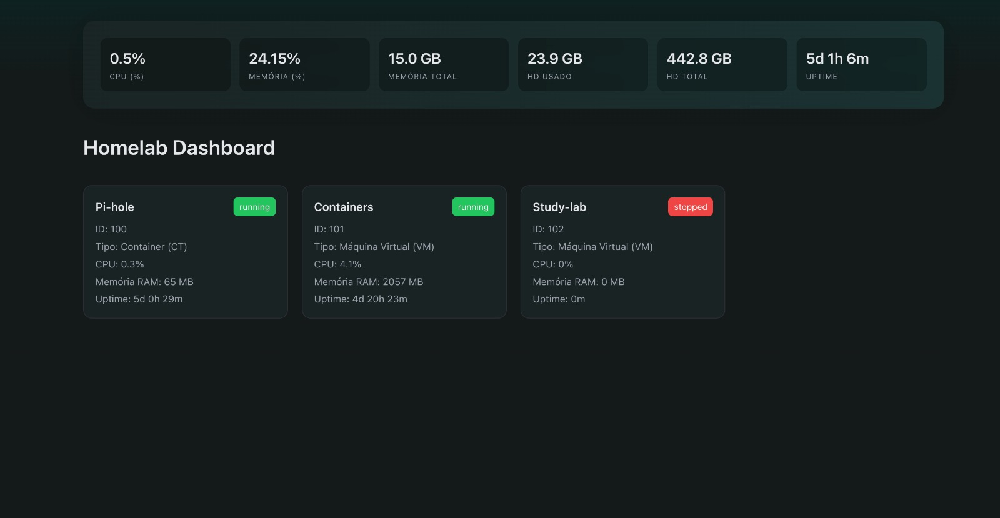

# Proxmox Dashboard API

Aplicação desenvolvida para consumo próprio com o objetivo de centralizar e simplificar a visualização dos recursos do meu servidor local baseado em Proxmox.

---

## Preview

<div align="center">
  
</div>

---

## Sobre o projeto

Este projeto consiste em uma aplicação fullstack com backend em Node.js + TypeScript e frontend em React, que consome a API do Proxmox e apresenta os dados em um dashboard personalizado.

A ideia principal é abstrair a complexidade da API do Proxmox e fornecer uma visualização simples, padronizada e de fácil leitura para monitoramento do ambiente.

---

## Objetivo

- Unificar dados de VMs e Containers (LXC)
- Normalizar o formato de resposta
- Exibir os dados em um dashboard visual
- Criar uma camada intermediária entre o Proxmox e aplicações customizadas

---

## Arquitetura

O projeto segue uma estrutura simples e escalável:

- **backend/**
  - **routes** → definição dos endpoints
  - **controllers** → controle das requisições HTTP
  - **services** → integração com a API do Proxmox
  - **interfaces** → tipagem com TypeScript
  - **guards** → validação de respostas externas

- **frontend/**
  - **components** → componentes reutilizáveis (ex: Card)
  - **pages** → páginas da aplicação (ex: Dashboard)
  - **services** → consumo da API
  - **formatter/helpers** → formatação e manipulação de dados

---

## Endpoint principal

### `GET /api/dashboard`

Retorna uma lista unificada de serviços (VMs + Containers):

```json
{
  "services": [
    {
      "id": 102,
      "name": "Study-lab",
      "type": "vm",
      "status": "running",
      "cpu": 0.12,
      "memory": 2048,
      "uptime": 123456
    }
  ]
}
```

---

## Tecnologias utilizadas

- Node.js
- TypeScript
- Express
- node-fetch
- dotenv
- React
- Vite
- styled-components

---

## Segurança

Essa aplicação foi desenvolvida para uso em ambiente local e privado, sendo acessada apenas através de rede interna/VPN.

Não possui autenticação própria por design, assumindo que o acesso já está protegido por infraestrutura de rede (ex: VPN).

---

## Observações

- Projeto voltado exclusivamente para uso pessoal
- Não foi pensado inicialmente para produção pública
- Tipagens e validações foram implementadas para maior segurança e previsibilidade
- Frontend e backend estão organizados em um único repositório (monorepo simples)

---

## Próximos passos

- Evolução do layout e experiência do dashboard
- Adição de métricas mais detalhadas
- Possível implementação de cache
- Expansão para controle de VMs (start/stop)
